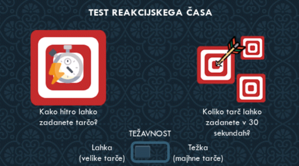

# ReactionTimer (TouchGFX / STM32H750)

A simple reaction timer game built with **TouchGFX** for the **STM32H750 Discovery Kit**.  
User must tap a target as fast as possible after it appears on screen — the program measures their reaction time and displays it.

---

## Features

- Touch button-based reaction test
- Difficulty toggle (changes target size or delay)
- Randomized target appearance using a custom random function

---

## Requirements

- [STM32CubeIDE](https://www.st.com/en/development-tools/stm32cubeide.html)
- [STM32CubeProgrammer](https://www.st.com/en/development-tools/stm32cubeprog.html)
- [TouchGFX Designer](https://www.st.com/en/development-tools/touchgfxdesigner.html)
- STM32H750B-DK Discovery Kit
- Micro USB cable

---

## Setup Instructions

1. **Clone this repository**
    ```bash
    git clone https://github.com/yourusername/ReactionTimer.git
    cd ReactionTimer
    ```
1.1 **Or download a zip in [Releases](https://github.com/mattbernot/ReactionTimer_STM32H750B/releases) and extract it**
    

2. **Open the `ReactionTimer.touchgfx` file** with **TouchGFX Designer**:
    - Click on generate code
    - Run simulator or build & run if you have STM32H750B-DK connected.

3.1. **Or build the project in STM32CubeIDE**
    - Set the build target to `STM32H750B-DK`
    - Build the project (`Project > Build Project`)
    - Flash it to your `STM32H750B-DK` (`Run > Debug` or `Run > Run`)

---

## How It Works

1. On startup, select **difficulty** using the toggle.
2. Tap the first button for single target — wait for the target to appear.
3. Or tap the second button for multiple targets.
4. Tap the target as fast as possible.
5. The program will show your **reaction time** in milliseconds.
6. Press the reset button to retry.

> The target appears after a short random delay.
> Difficulty changes:
> - **Easy**: Large target (50x50 px)
> - **Hard**: Small target (20x20 px)



---

## Youtube overview
[](https://www.youtube.com/watch?v=ESDqSOgw8tY)
